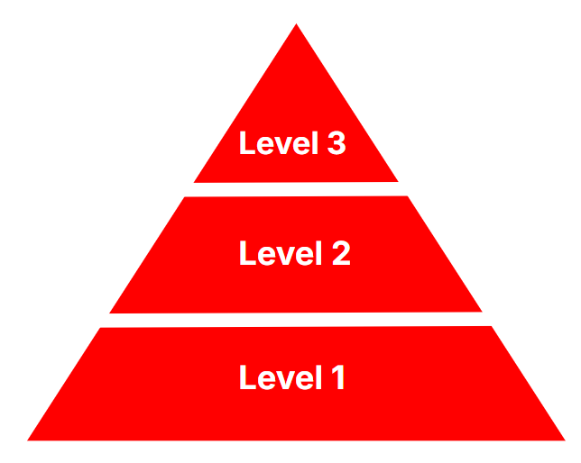

# 3 Levels of Projects

This is a list containing ideas for the three different levels of projects you can build. You can find an explanation for the different levels of projects in this YouTube Video

## Level 1: Simple

### Examples:
#1. To-Do App
#2. Calculator App
#3. Weather App
#4. Quiz App
#5. Recipe Finder
#6. Weather App
#7. Expense Tracker
#8. Memory Game
#9. Counter App

## Level 2: Capstone

### Examples:
#1. E-commerce App
#2. Real-time chat application
#3. Social Media App
#4. Top Tech Clones (Netflix, Twitter, Amazon, etc...)
#5. Movie Streaming app

## Level 3: Commercial

### Examples:
#1. Static Website for Local Restaurant
#2. Appointment Booking App for Local Barbershop
#2. AI Personal Training App w/ Android and IOS apps
#3. Password Manager Extension deployed on the Chrome Store
#4. AI Habit Tracker w/ 500 users

Get more ideas for commercial projects [here]("https://producthunt.com") 
